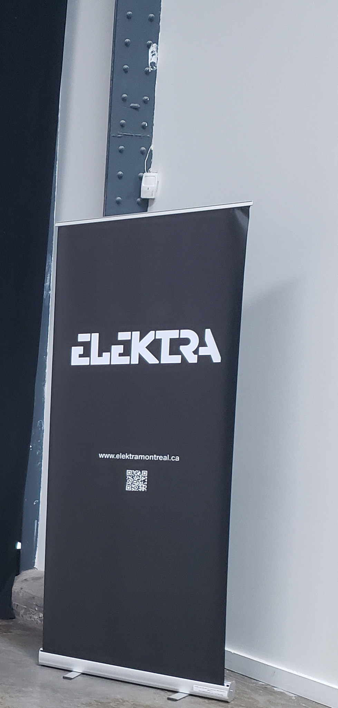
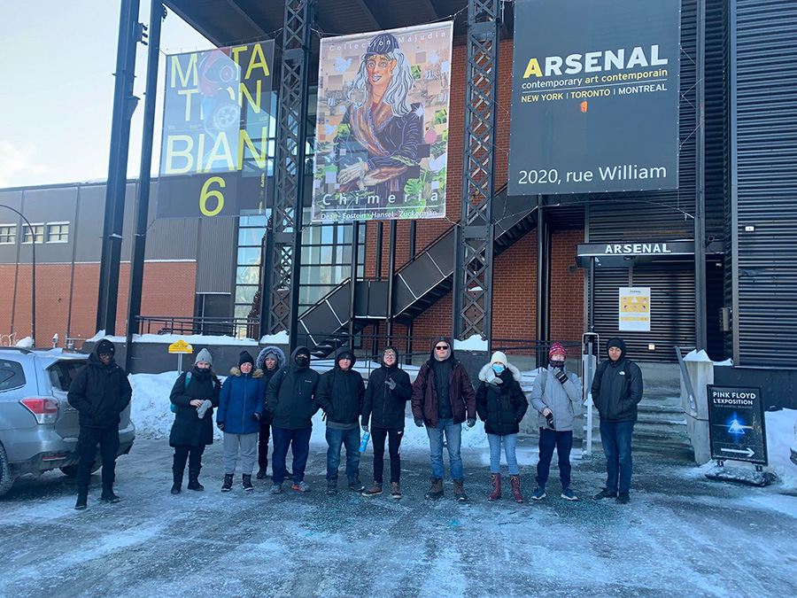
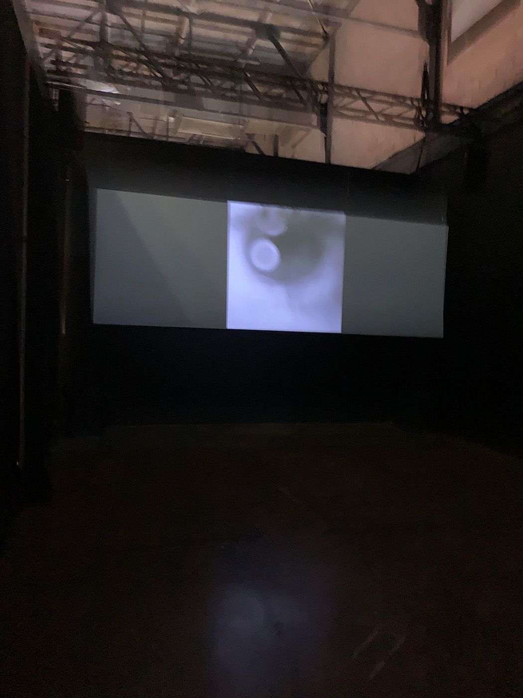
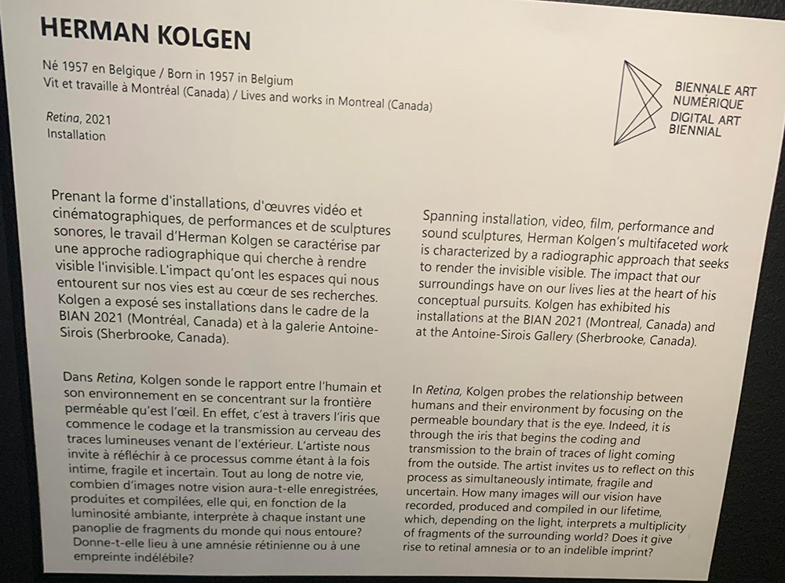
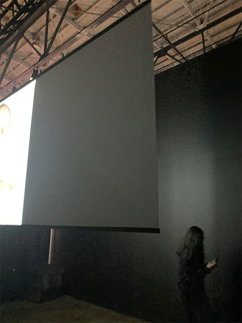
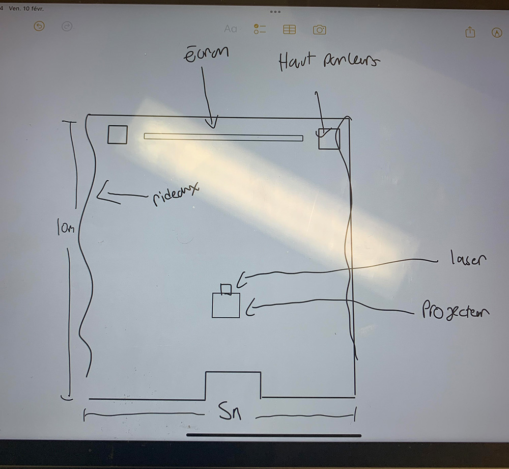

# fiche BIAN sur Retina

### Nom de l'exposition ou de l'événement :
BIAN 6 Mutation

  
  *(Photo prise par Jérémy Roy-côté)*
  
  
  
  
  
  
  ### Lieu de mise en exposition :
  Arsenal art contemporain (Montréal) 
  
  
  *(Photo prise par Khaly Tia Sing)*
  
  
  ### Type d'exposition :
  Temporaire
  
  ### Date de votre visite :
  Vendredi le 3 février 2023
  
  ### Titre de l'oeuvre :
  Retina 
  
  
  ### Nom de l'artiste :
  Herman Kolgen
  
  ### Année de réalisation :
  2021
  
  ### Description de l'oeuvre :
  Retina est une exposition cinématographique démontrant comment le cerveau peut capter son environnement avec l’œil. L’œuvre démontre qu’avec l’œil, il est possible au cerveau de recevoir le codage et la transmission de la  lumière. 
  
  
  
  
  
  
  ### Type d'installation :
  Installation comtemplative 
  
  
  ### Mise en espace :
  L'oeuvre est situé dans une piece ouverte ( encadré par des rideaux). Cette oeuvre prend toute la place de la piece puisque le projecteur et l'ecran doivent être éloigné pour que les projections puissent éclairer l'écran. L'écran était situé dans un mur au fond, accompagné des haut-parleur qui étaient au sol, et les projections (projecteur et laser) se situaient au milieu de la pièce. La pièce mesurait environ 5m de large par 10m de long.
  
  *pour la vue d'emsemble voir la photo précedente* 
  
  
  
  
  
  
  
  

