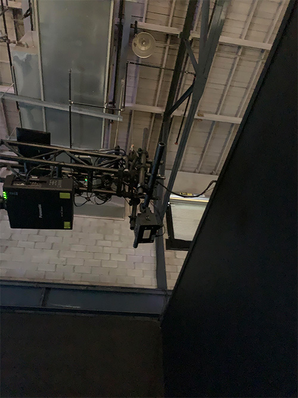

# fiche BIAN sur Retina

### Nom de l'exposition ou de l'événement :
BIAN 6 Mutation

  
  *(Photo prise par Jérémy Roy-côté)*
  
  
  
  
  
  
  ### Lieu de mise en exposition :
  Arsenal art contemporain (Montréal) 
  
  
  *(Photo prise par Khaly Tia Sing)*
  
  
  ### Type d'exposition :
  Temporaire
  
  ### Date de votre visite :
  Vendredi le 3 février 2023
  
  ### Titre de l'oeuvre :
  Retina 
  
  
  ### Nom de l'artiste :
  Herman Kolgen
  
  ### Année de réalisation :
  2021
  
  ### Description de l'oeuvre :
  Retina est une exposition cinématographique démontrant comment le cerveau peut capter son environnement avec l’œil. L’œuvre démontre qu’avec l’œil, il est possible au cerveau de recevoir le codage et la transmission de la  lumière. 
  
  
  
  
  
  
  ### Type d'installation :
  Installation comtemplative
  
  
  
  ### Mise en espace :
  L'oeuvre est situé dans une piece ouverte ( encadré par des rideaux). Cette oeuvre prend toute la place de la piece puisque le projecteur et l'ecran doivent être éloigné pour que les projections puissent éclairer l'écran. L'écran était situé dans un mur au fond, accompagné des haut-parleur qui étaient au sol, et les projections (projecteur et laser) se situaient au milieu de la pièce. La pièce mesurait environ 5m de large par 10m de long.
  
  
  
  
  ### Composantes et techniques:
  coposantes:
  * Le projet vidéo (est dans un disque dur externe ou dans un autre objet qui peux garder l'information)
  * Laser
  * Projecteur
  
  
  
  ### Élements nécéssaires à la mise en exposition :
  * Écran 
  * Projecteur 
  * Laser 
  * Haut-parleurs
  * Bancs 
  * Rideaux
  
  
  
  
  
  
  
  ### Expérience vécue :
  Pour cette oeuvre, le visiteur est libre de se positionner dans la pièce. Celui-ci peut rester debout ou s'asseoir sur un banc pour pouvoir regarder l'écran devant celui-ci. Puisque l'écran est positionné dans le fond de la pièce, le visiteur peut se rapprocher ou se distancer de l'écran. Puisque l'oeuvre est une vidéo qui as pour but d'attirer l'oeil, l'interracteur s'attend à divertir le vissiteur et le visiteur s'attend a être diverti par la vidéo. L'oeuvre m'a fait vivre plein d'émotions, du début jusqu'a la fin. Il y avait des moment ou l'écran était noir et l'ambiance était calme et des moment ou tout se déroulait rapidement, ce qui donnait plus de suspence et démotions à la vidéo.
  
  ### Ce qui vous a plus, vous a donné des idées :
  Ce qui m’a plu le plus est l’œuvre  Retina est la lumière et le son puisque le but de l’œuvre est de pouvoir représenter l’œil et cela a fonctionné puisque j’ai choisit l’œuvre. Puisqu'il est facile pour moi de comprendre les émotions et de les ressentir, il y avait plusieurs moments quo ont étés cherché mes émotions, comme la fin puisque le son était fort et les images et la lumière du laser beougait rapidement sur l'écran. L'oeuvre m'a donné beaucoup d'idées sur les jeux de lumière ( pour faire en sorte que les visiteurs soient attirées) avec la vidéo et des projecteurs. 
  
 ### Aspect que vous ne souhaiteriez pas retenir pour vos propres créations ou que vous feriez autrement :
  Personnellement il n’y a pas beaucoup de chose qui ne m’a pas plus puisque j’adore le multimédia et la majorité des œuvres étaient liée au multimédia.
  
  

