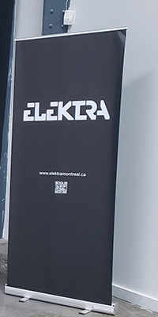

# fiche BIAN sur Retina

### Nom de l'exposition ou de l'événement :
BIAN 6 Mutation

  
  *(Photo prise par Jérémy Roy-côté)*
  
  
  
  
  
  
  ### Lieu de mise en exposition :
  Arsenal art contemporain (Montréal) 
  
  
  *(Photo prise par Khaly Tia Sing)*
  
  
  ### Type d'exposition :
  Temporaire
  
  ### Date de votre visite :
  Vendredi le 3 février 2023
  
  ### Titre de l'oeuvre :
  Retina 
  
  
  ### Nom de l'artiste :
  Herman Kolgen
  
  ### Année de réalisation :
  2021
  
  
  
  

