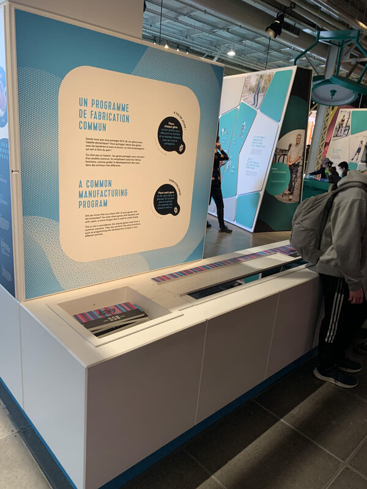

# Documentation dispositif salle des sciences

### Nom de l'exposition ou de l'événement :
Humain

### Lieu de mise en exposition (photo de moi devant lentree) :
Salle des sciences

*photo prise pas Karine Lécuyer*

### Type d'exposition :
Permanent

### Date de la visite :
Mercredi le 12 avril

### Titre de l'oeuvre ou du dispositif (photo Vue d'ensemble de l'oeuvre ou du dispositif) :
Un programme de fabrication commun

### Année de réalisation :
2022/2023 

### Description du dispositif :

L’exposition propose de vivre les multiples métamorphoses de l’être humain depuis ses origines, de comprendre pourquoi et comment le corps se transforme à chacune des étapes de la vie. Amusez-vous à vous glisser dans la peau de l’autre et laissez-vous émerveiller par un regard unique sur la beauté et la richesse du corps humain. [Salle des sciences](https://www.centredessciencesdemontreal.com/exposition-permanente/humain)

Ce dispoditif permet aux visiteurs d'apprendre sur la fabrication de l'ADN et de ses code génétique. Les visituers doposent des planches,contenant une image d'oragnisme/animal, sur une table avec un dessin de code génétique représenté par des lignes de couleurs. Chaque planche contienent une série de ligne de couleur qui doit être placé au bon endroit sur la table pour pouvoir correspondre identiquement avec celle-ci. Lorsque cette étape est exécuté, les lumieres en dessous s'allument pour révèler de l'information sur l'organisme/animal.

### Type d'installation :
Interactif

### Fonction du dispositif :
Ce dispositif a pour but d'éduquer les visiteurs sur l'ADN et la composition des codes génétiques de différents organismes.

### Mise en espace :

Le dispositif se situe proche de l'entrée de la salle de l'exposition. Celui-ci occupe une espace moyenne et est disposé en longueur.

### Éléments pour la mise en exposition :
* affiche

* fils

* lumière

* LED

* pièces

### Expérience vécue :

Les visiteurs doivent pendre chaque morceaux et les placer au bon endroit en s'assurant que chaque suite de couleur correspondent avec ceux affiché sur la table. Si le visiteur voit que des informations s'affichent en dessous du morceau, cela indique que les couleurs sont correctement placés.  

### Ce qui m'a plu :
Ce que j'ai bien aimé du dispositif est comment les indications sont claire, sans avoir besoin de l'écrire. Par exemple, lorsque j'ai essayé le dispositif, j'ai pu facilement savoir que je devais placer les morceaux sur la table en voyant les couleur sur ceux-ci et sur la table. 

### Ce qui ne m'a pas plu :

La seule chose que je n'ai pas aimé est qu'il y avait beaucoup d'enfants qui crianent et faisaient beaucoup de bruit.

