# Documentation sur la version finale de Mycelium

### Nom de l'exposition ou de l'événement :
Mycelium

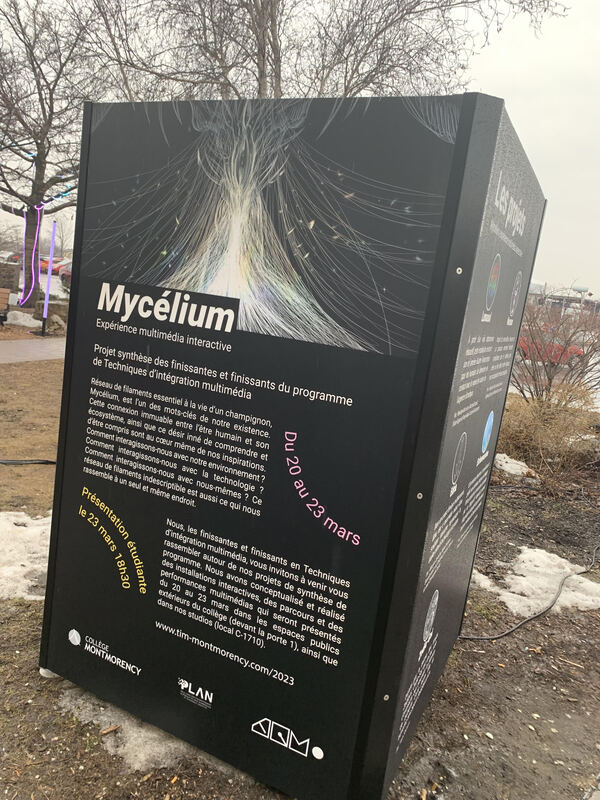

### Lieu de mise en exposition (photo de moi devant lentree) :
Collège Montmorency

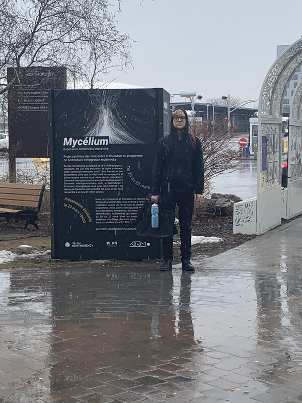

### Type d'exposition :
Temporaire

### Date de la visite :
vendredi le 17 mars 2023

### Titre de l'oeuvre ou du dispositif (photo Vue d'ensemble de l'oeuvre ou du dispositif) :
Edria

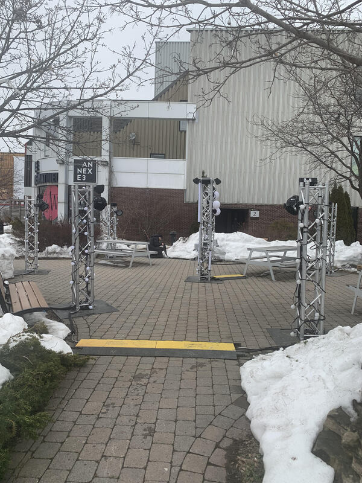

### Nom des créateurs de l'oeuvre :
* [Elwin Durand](https://tim-montmorency.com/2023/projets/EDRIA/docs/web/journal_1.html)
* [Loic Delore](https://tim-montmorency.com/2023/projets/EDRIA/docs/web/journal_2.html)
* [Dominic Roberts](https://tim-montmorency.com/2023/projets/EDRIA/docs/web/journal_3.html)
* [Gabriel Leblanc](https://tim-montmorency.com/2023/projets/EDRIA/docs/web/journal_4.html)
* [Meryem Berbiche](https://tim-montmorency.com/2023/projets/EDRIA/docs/web/journal_5.html)
* [Jean-Christophe](https://tim-montmorency.com/2023/projets/EDRIA/docs/web/journal_6.html)

### Année de réalisation :
2022/2023 

### Description de L'oeuvre :
Traversant un hiver froid et glacial, des explorateurs arrivent en terre inconnue : EDRIA. Des piliers se dressent, et un écosystème hors de ce monde se dévoile sous leurs yeux. Une structure centrale attire l’attention des explorateurs. Intrigués, ils rentrent dans cette espace insolite et s'approchent de la dite structure: des lumières s'allument, des sons se déclenchent, et il semblerait que la présence de plusieurs personnes soit nécessaire pour progresser...
[source](https://tim-montmorency.com/2023/projets/EDRIA/docs/web/index.html)

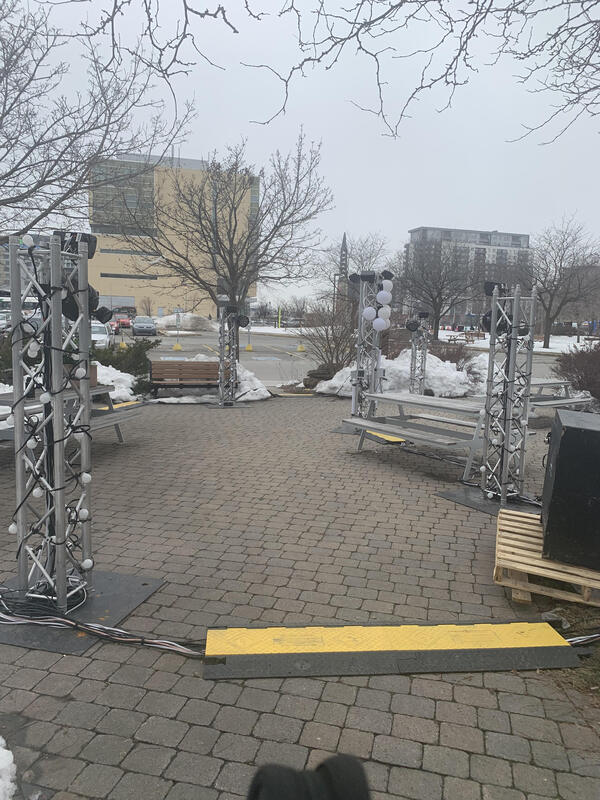

### Type d'installation :
interactive

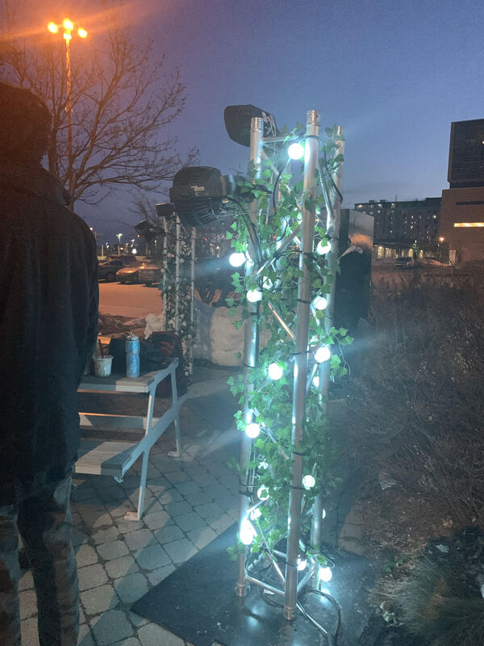

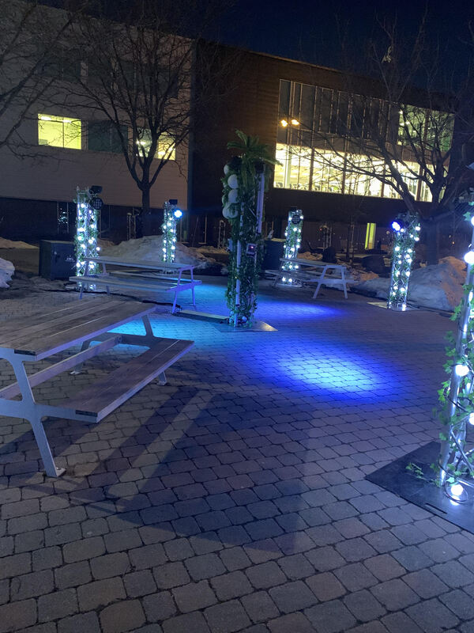

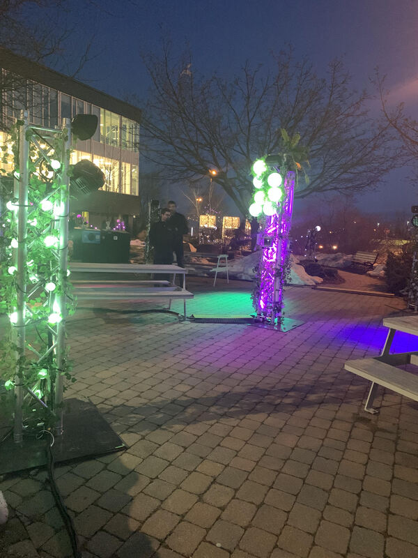

### Mise en espace :

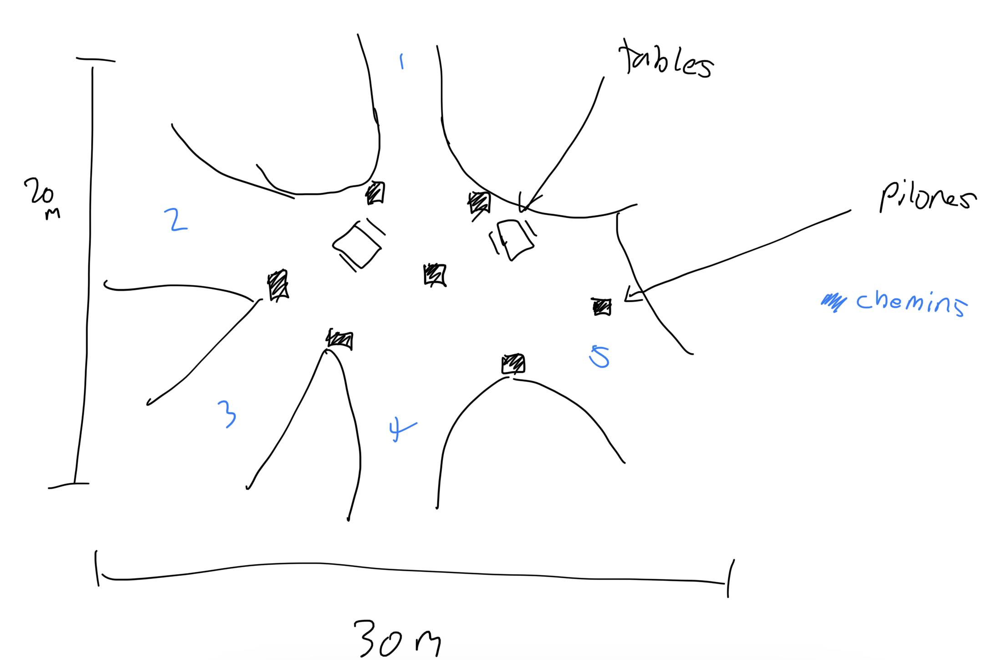

### Composantes techniques :
* Des fils et des cables 

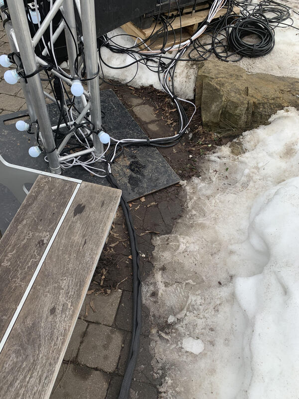

* Un ordinateur

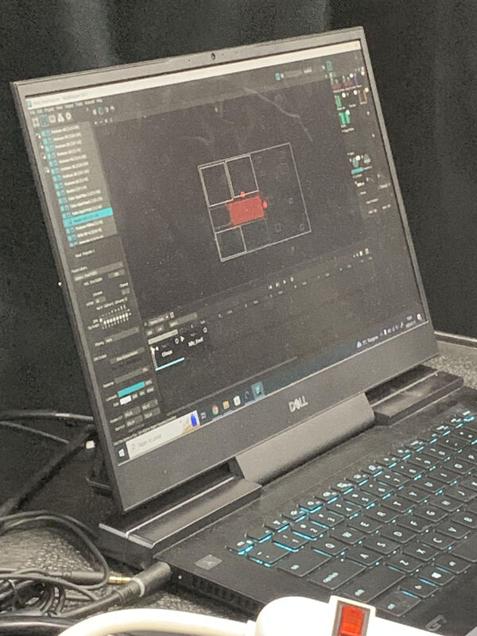

* Les logiciels pour pouvoir programmer

* Des pylones de métal

* Des lumières (DEL)

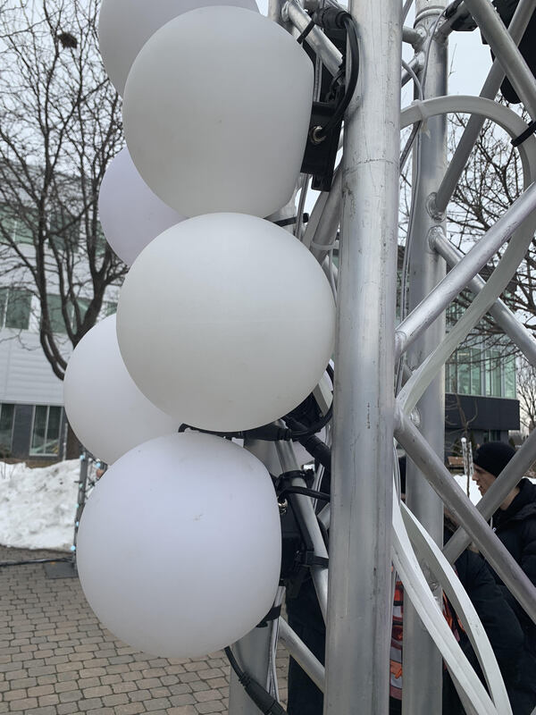

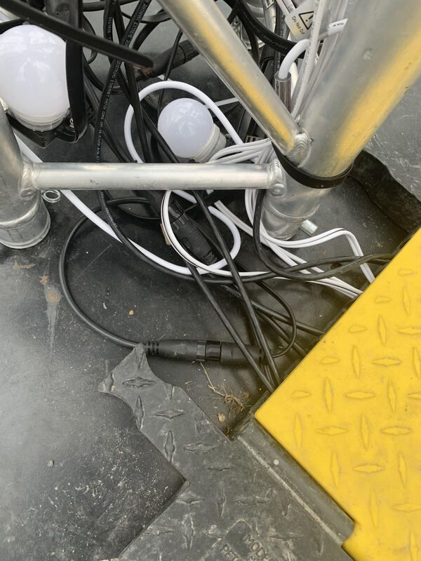

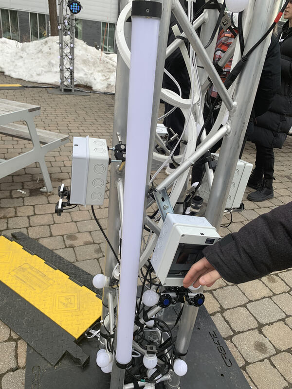

* Des capteurs de mouvements 

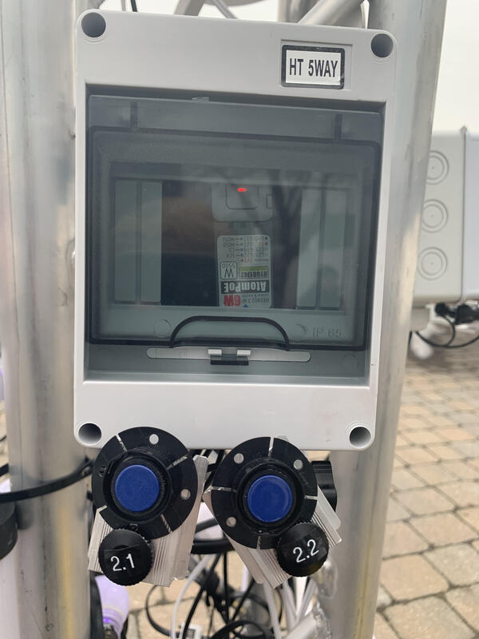

* Des Haut-parleurs

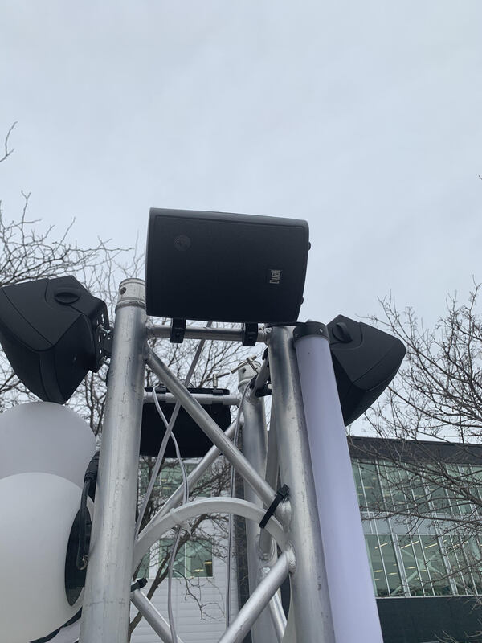

* Des projecteurs de lumiere

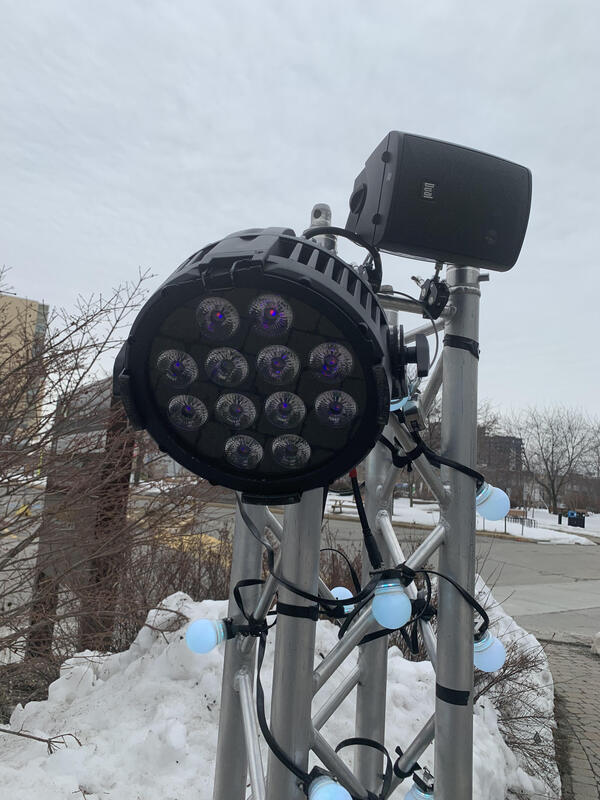

* Cable protecteur pour les pietons

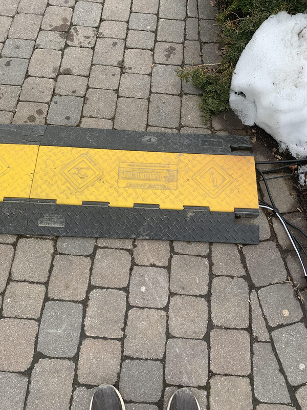

*  Caméras de surveillance

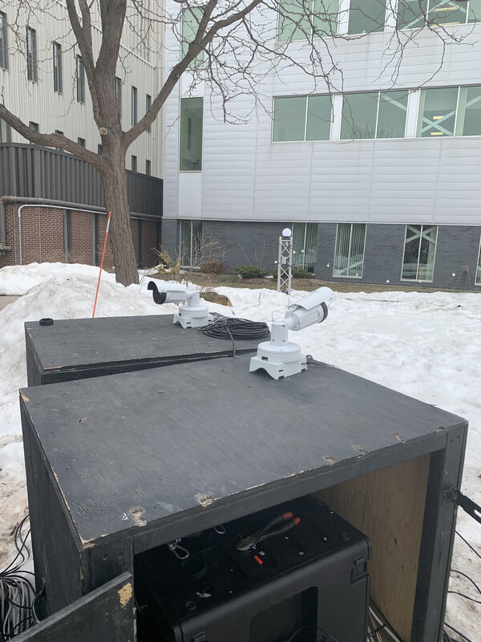

*  Décorations (buissons)

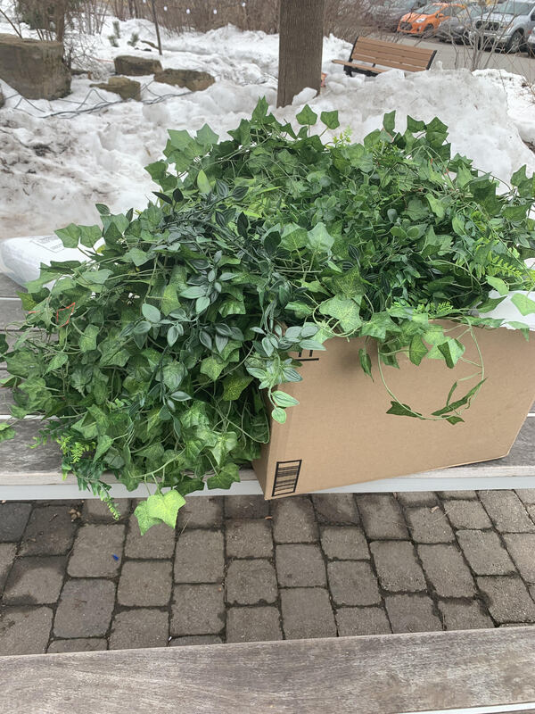

### Éléments pour la mise en exposition :
* Des bancs

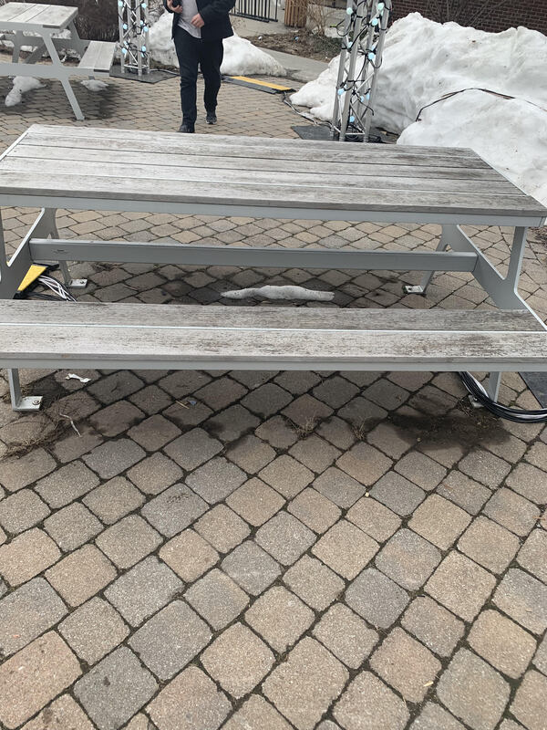

* Un endroit pour l'exposition

### Expérience vécue :

Les visiteurs peuvent entrer par 8 entrées pour se rendre au millieu du lieu. Les visiteurs doivent se placer devant des capteurs de mouvement pour pouvoir activer les animations ( jeu de lumières et son). Ceux-ci sont différentes dépendamment du nombre de capteurs qui sont activées. Une animation spécial est activé l'orsque tous les capteurs sont déclenchés. Les visiteurs peuvent s'asseoir à des tables ou rester debout et sont libres de se positionner n'importe où pour regarder l'exposition.

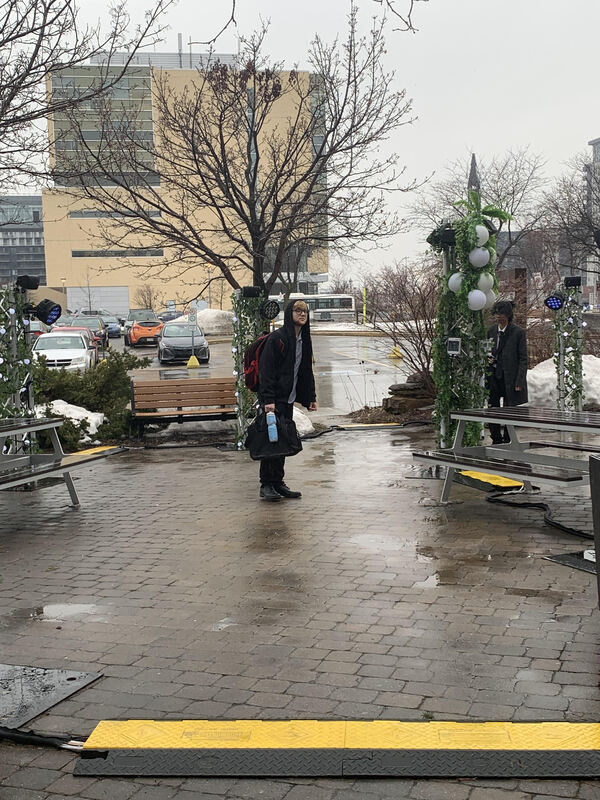

### Ce qui m'a plu :
J'ai aimé l'oeuvre au complet, la  raison pur laquelle j'ai décidé de faire une documentation sur celle-ci. La musique et les jeux de lumière se complémentaient et il n'y avait pas de problèmes liées au dispositif multimédia. 

### Ce qui ne m'a pas plu :

Il n'y a rien qui ne m'a pas plus pusique j'ai aimé le projet au complet.

### Évaluation des expositions:

1. Edria
2. Echomarine
3. Zordie-Gal
4. Nexum
5. Lumasol
