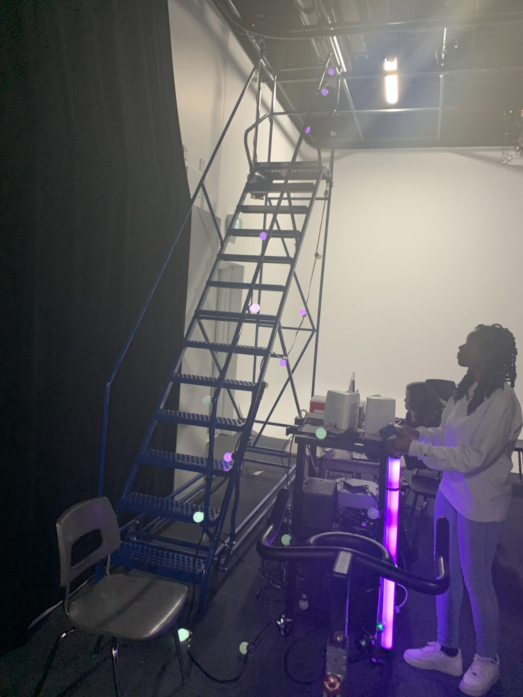
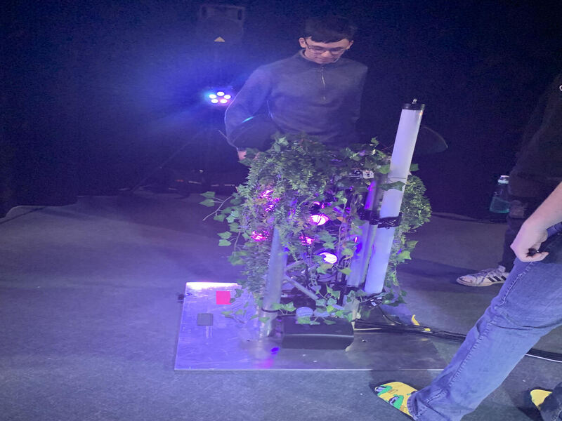
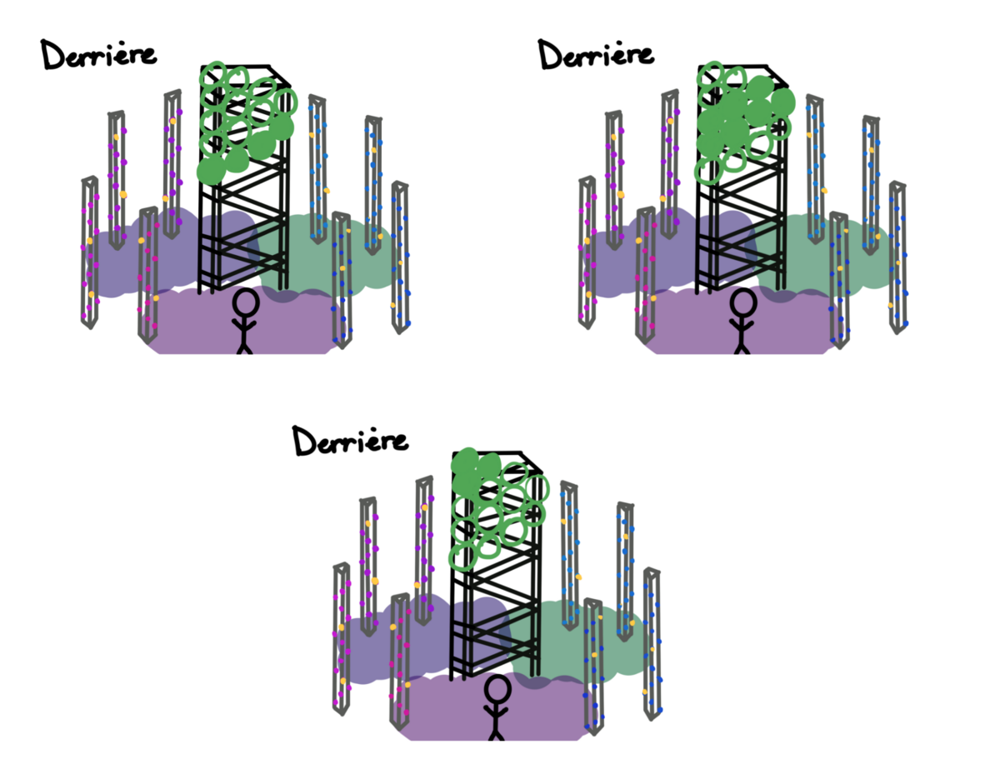
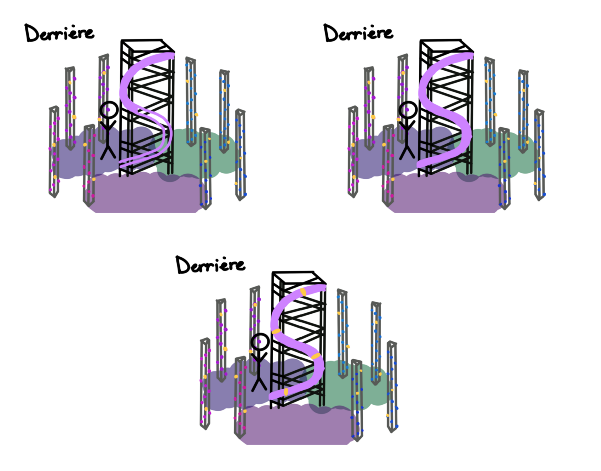
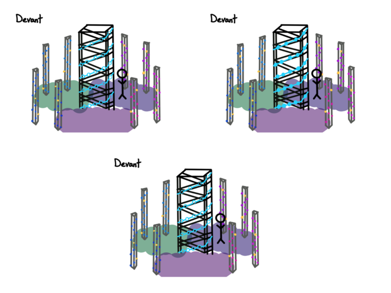
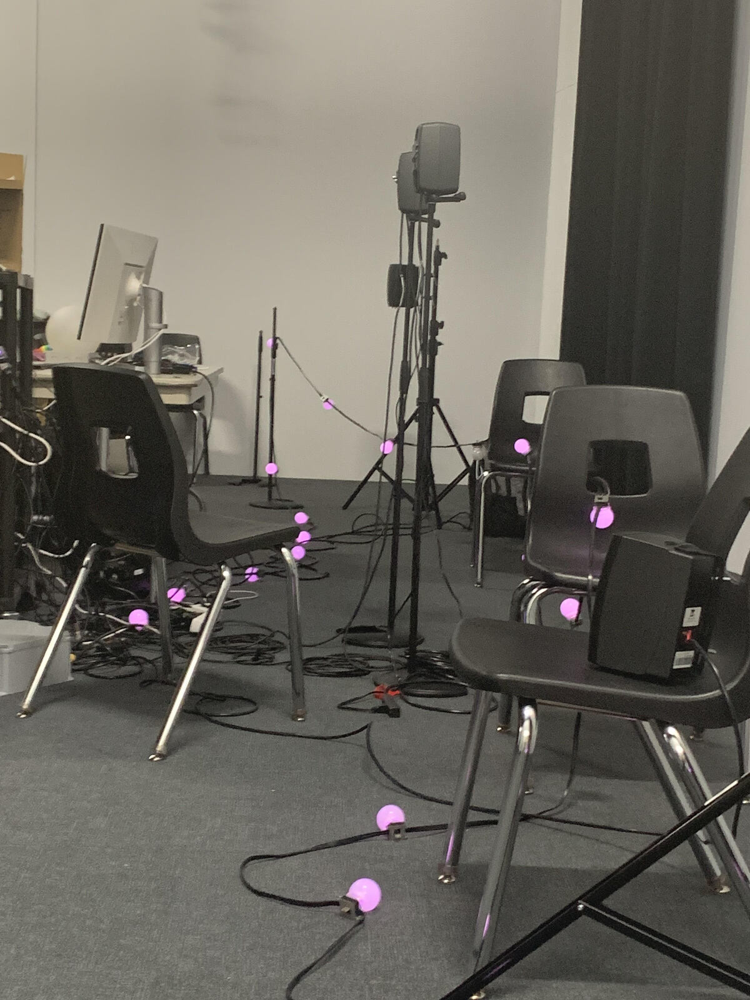

## Projet 1 : Lumasol 

### créateurs : 
* Éloise Gagné
* Skayla Stimphil
* Michaël Simard 
* Pénélope Marrisson

### lien entre le projet et le thème :
Le mycélium conencte la végétation ensemble. Le vélo stationnaire, de la même manière, est connecté aux lumières qui représentent les saisons.

### description de l'installation en cours :
Il y a un échelle avec des lumieres suspendus, un vélo stationnaire, de ordinateus et une batterie. Les lunières sont connecté à une batterie qui est liée a une poulie. Celle-ci, lorsqu'elle est en mouvement produit par le vélo stationnaire, créé de l'énergie qui active la batterie, qui fait allumer les lumières. Lorsque le vélo est au repos, il y a une musique d'ambiance et une faible animation lumineuse provenant des lumières.

## Projet 2 : Edria 

### créateurs :
* Elwin Durand
* Loic Delore
* Dominic Roberts
* Gabriel Leblanc
* Meryem Berbiche
* Jean-Christophe

### lien entre le projet et le thème :
Le but de l'installation est de demontrer le liens entre les humains et l'espace pour retrouver ses amis avec les onditions métérologiques dans lesquelles l'oeuvre sera mis en exposition.

### description de l'installation en cours :
Il y avait 4 poutres placées au quatres coins et une au milieu. Ceux-ci étaient décoré par des plantes et des projecteurs. La poutre du milieu contenait des capteurs TOF qui étaient lié aux lumieres et au ordinateurs. Lorsque les gens se placaient devant les capteurs, les lumieres et de la musique était décllanché. Lorsque les capteurs n'etaient pas déclanchés, il y avait des animations de fond.

*(plan fait et pris par Elwin Durand, Loic Delore, Dominic Roberts, Gabriel Leblanc, Meryem Berbiche et Jean-Christophe)*

 ## Projet 3 : Nexum 
 
 ### créateurs :
 * Sébastien Rielly
 * Sabrina Laforest
 * Alexandre Daniel
 * Maxime Des lauriers

 ### lien entre le projet et le thème :
 Mycelium est une connection entre les racines et nexum, connecte les personnes puisqu'il relie deux autres projets.
 
 ### description de l'installation en cours : 
 Il y avaix une lignée de lumiere qui etait  posé sur deux chaises. Les lumieres étaient connecté a un ordinateur qui créait les animation des lumières.  Il y avait    des haut-parleurs qui étaient posé sur des chaises qui produiront une musique d'ambiance.
 

## Projet 4 : Zordiegal

### créateur :
* Abdanor yara

### lien entre le projet et le thème :
Il n'y avait pas beaucoup de lien, mais ce projet a l'histoire d'une jeune fille qui aprend à se connaître en combattant des monstres qui représentent les signes du zodiaque.

### description de l'installation en cours :
Le projet se situait dans une petite pièce et il y avait un ordinateur avec des haut-parleurs qui y était connecté.

## Projet 5 : Échomarine

### créateurs :
* Florence Lapierre
* Natacha Abdallah
* Tracy Gua
* Maria Laura Coronel

### lien entre le projet et le thème :
Ce projet, comme Mycélium, a pour but de montrer la nature (marine). Aussi, Mycélium montre le lien entre l'humain et la nature, Échomarinee montre l'impact de l'humain sur la nature.

### description de l'installation en cours :
Il y avait des projecteurs et des haut-parleurs qui étaient branché à une tablette qui était connecté à des ordinateurs. Lorsqu'on appuyait sur des animaux qui étaient sur la tablette, il y avait une animation qui montrait l'animal en action. Lorsqu'aucune touche est appuyé, il y a une musique d'ambiance.

### émotions ressenti lors de l'exposition des projets ;
Personnellement, lors de l'exposition, je pense que je vais être ipressionné, peut-être même bouchebé, puisque j'adore les projets interratifs immersifs qui contiennent de la projection, des lumières et de la musique.

### Cours de la techique pour réaliser ce style de projet :
* Audio
* Animation 2d
* Objet interactif

### classement des projets :
* 1 :  Edria
 
* 2 : Lumasol

* 3 : Nexum

* 4 : Echomarine

* 5 : Zordie-Gal 

Mon projet préféré est Edria puisque le concept était original et le lien avec le thème était comprennable. J'ai aussi aimé la démonstration du projet, la manière dont la musique et les lumières s'activent lorsque les capteurs sont activés. Le projet que j'ai mis en dernier est Zordie-Gal puisque je ne voyait pas de lien avec le thème. Cependant, les dessins était très beau et le concept, pour un jeu vidéo, était original.

### composante technique choisie : Capteur TOF ( Temps de Vol ) 
