# Présentation de documentation sur Transformé de OASIS immersion 

### Nom de l'exposition ou de l'événement :
Transformé

### Lieu de mise en exposition (photo de moi devant lentree) :
Oasis immersion

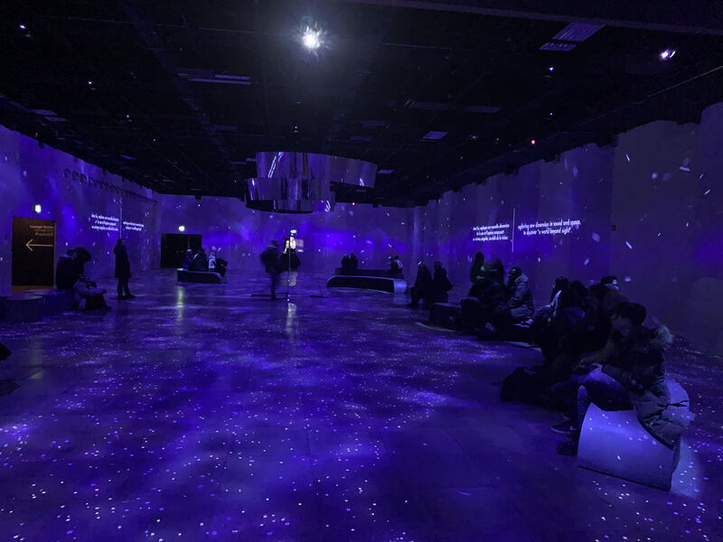

### Type d'exposition :
Temporaire

### Date de la visite :
vendredi le 24 février

### Titre de l'oeuvre ou du dispositif (photo Vue d'ensemble de l'oeuvre ou du dispositif) :
Transformé

### Année de réalisation :
2022/2023 

### Description de L'oeuvre :
Pour la première fois, une expérience immersive déambulatoire complète a été développée à partir d’œuvres initialement conçues pour les casques de réalité virtuelle. Il s’agit d’une véritable prouesse technologique réalisée sous la direction de l’équipe d’OASIS immersion, en collaboration avec quelques-uns des meilleurs talents en réalité virtuelle à l’échelle internationale. Au cœur du projet, huit récits réunis dans une expérience collective où le courage et l’empathie seront les thèmes centraux. [OASIS Transformé](https://oasis.im/transforme/?utm_term=oasis%20immersion&utm_campaign=DIG+-+%5BS%5D+-+ECOM+-+FR+-+CAN+-+Brand+-+Transform%C3%A9&utm_source=adwords&utm_medium=ppc&hsa_acc=4321666449&hsa_cam=19225434888&hsa_grp=146883843240&hsa_ad=641001229580&hsa_src=g&hsa_tgt=kwd-1715752844287&hsa_kw=oasis%20immersion&hsa_mt=e&hsa_net=adwords&hsa_ver=3&gclid=CjwKCAjw9J2iBhBPEiwAErwpecNUCIs_Ns07UVL-DjI32MJCSK7LdHIGoDCmeKfGXDxtoHS2VLw46BoCI2YQAvD_BwE)

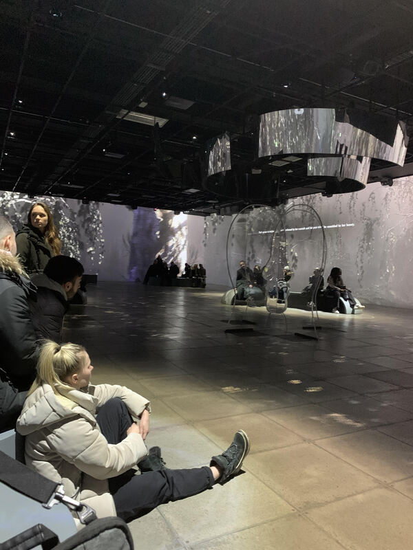
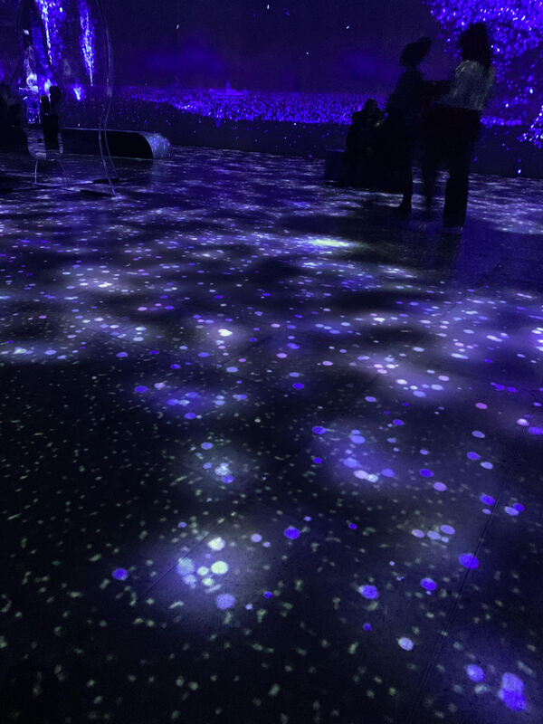

### Type d'installation :
immersive et interactive

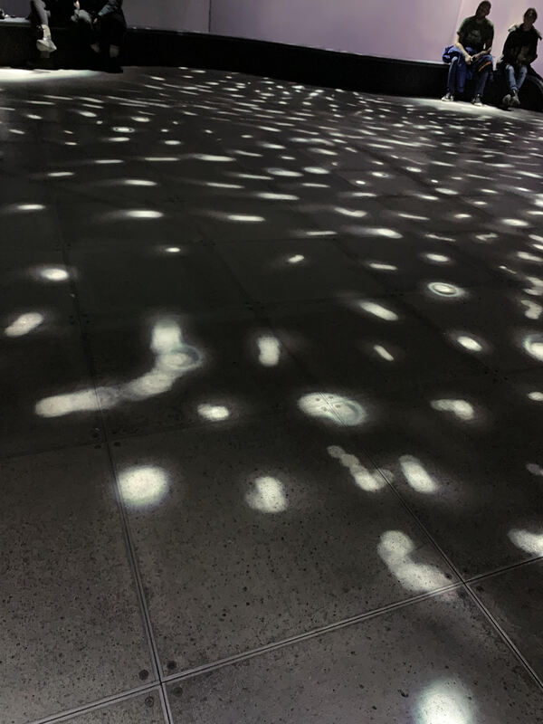

### Mise en espace :

L'exposition se déroule dans trois pièces et chaques pièces contiennent plusieurs gros projecteurs qui projectent aux murs et plusieurs petit projecteurs qui projectent au sol. Pour chaques pièces, il y a différents types de bancs pour pouvoir s'asseoir. La troisième piece contient de long bancs et des miroirs au millieu de la pièce.

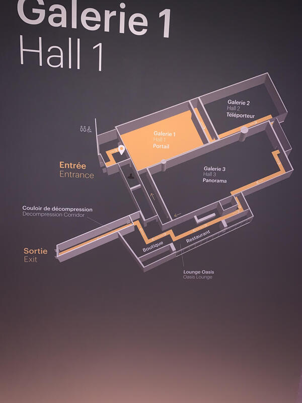

### Composantes techniques :
* vidéos des expositions vr

[Notes on blindness](https://youtu.be/ef-Id3PsEzM)

[Conscious existance](https://youtu.be/FbicMIHg2XQ)

video par [AltVR](https://www.youtube.com/@AltVR_YouTube)

[Goliath](https://youtu.be/QdcfLwZZ114)

### Éléments pour la mise en exposition :
* Des bancs

* Mirroirs au millieu

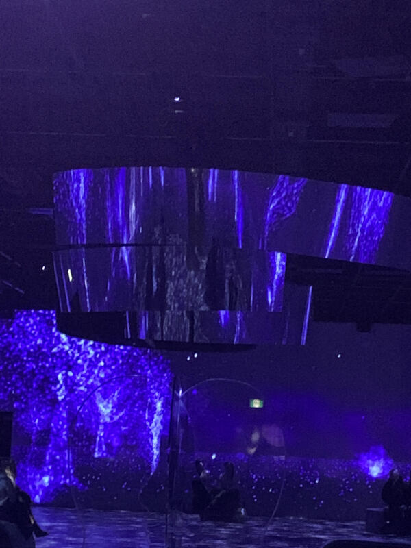

* Haut-parleurs

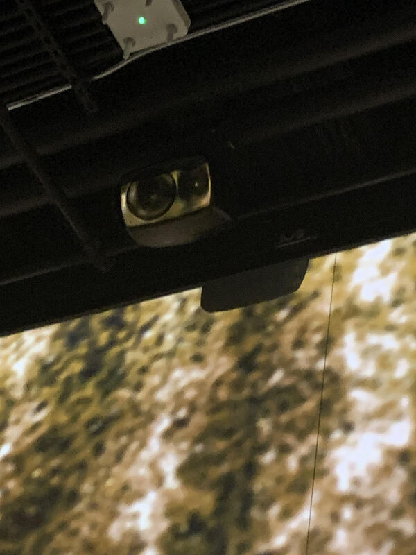

* Projecteurs(gros)

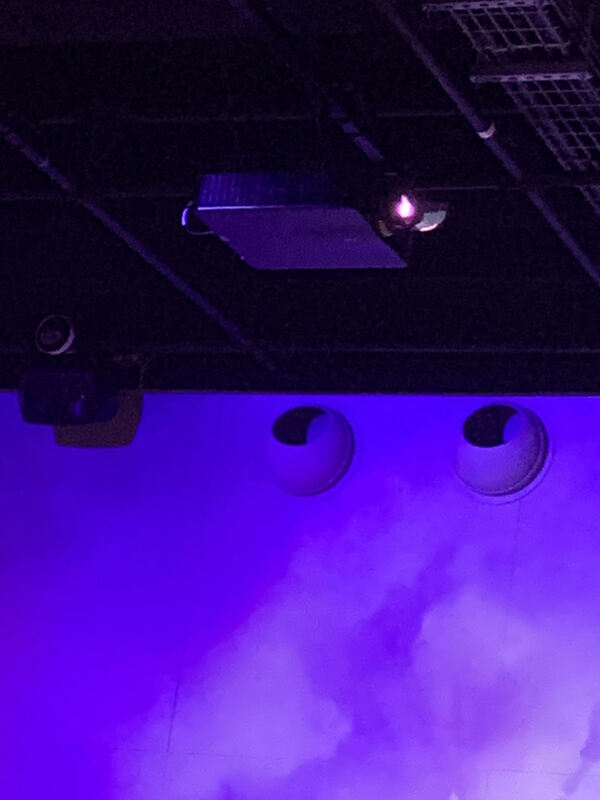

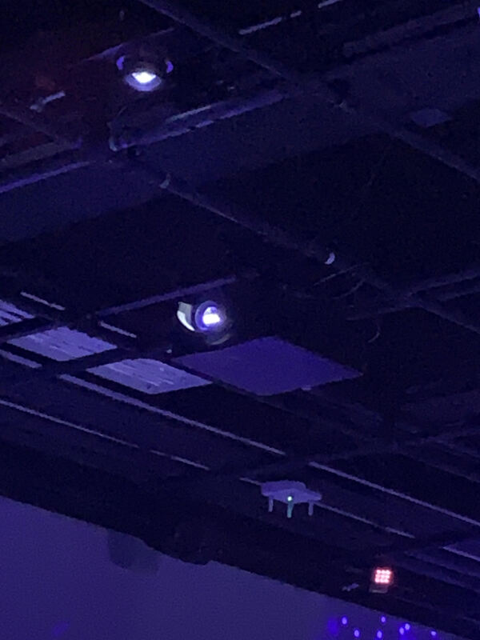

* Projecteurs(petits)

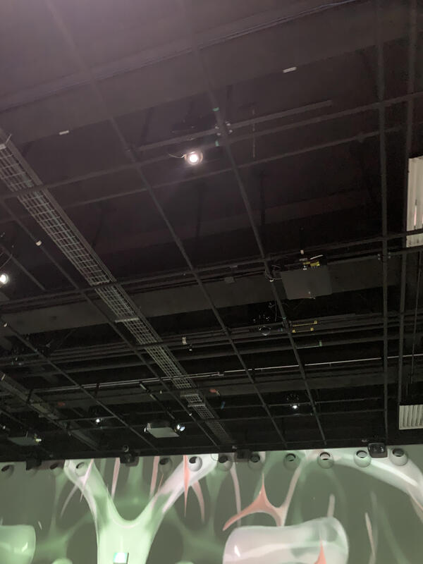

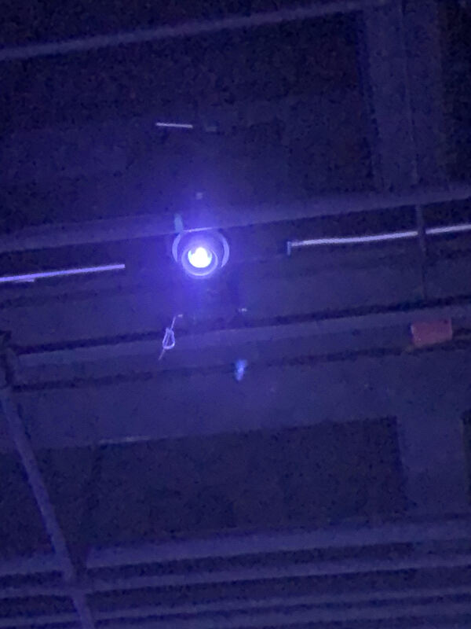

### Expérience vécue :

Les visiteurs doivent s'assoir à des bancs ou rester debout pour pouvoir regarder le spectacle de projetions. Il y a des projections sur chaques murs et aussi des projections au sol. Ces projections au sol s'animent lorsque les visiteurs se promènent.

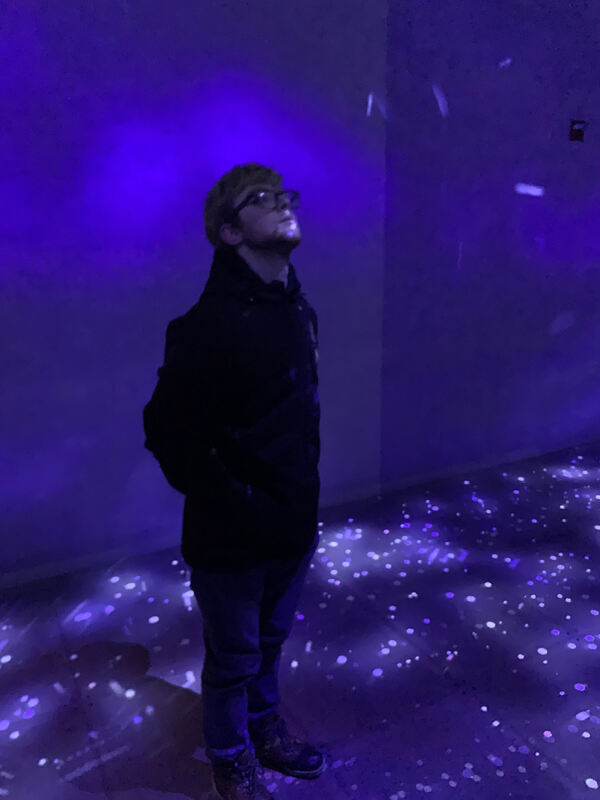

### Ce qui m'a plu :
J'ai aimé l'oeuvre au complet, la  raison pur laquelle j'ai décidé de faire une documentation sur celle-ci. J'ai adoré la première exposition de cette compagnieque j'ai visité, une autre raison pour laquelle j'ai décidé de faire une documentation sur celle-ci. Ce que j'ai le plus aimé, est le récit démontrant la ville de tokyo. Ce que j'ai aimé de cette partie est le mélange de couleurs et le mouvement en continu de la caméra, ce qui donne une impression de voler dans la ville.

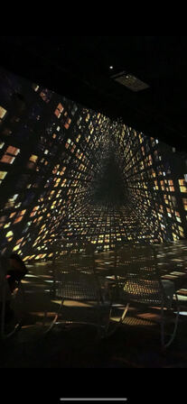

### Ce qui ne m'a pas plu :

La seule chose que je n'ai pas aimé est qu'il y avait beaucoup de gens la journée qu'on y avait été, donc beaucoup de bancs étaient deja pris.

